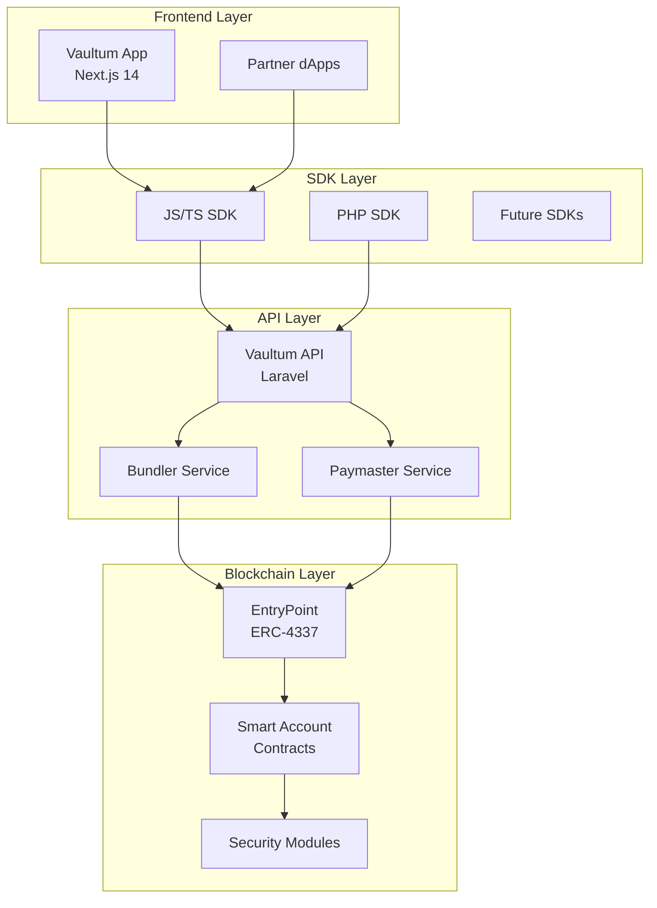

<div align="center">
  
  
  # Vaultum
  
  ### Programmable Security for Digital Assets
  
  [](https://vaultum.app)
  [](https://twitter.com/vaultumapp)
  [](LICENSE)
  [](https://eips.ethereum.org/EIPS/eip-4337)
  
  **Your keys. Your rules. Your vault.**
  
  [Documentation](https://docs.vaultum.app) • [Get Started](#-quick-start) • [Architecture](#-architecture) • [Contributing](#-contributing)
</div>

---

## 🎯 Vision

Vaultum transforms traditional wallets into **programmable vaults** with fine-grained security controls. Built on ERC-4337 account abstraction, we enable users to define exactly how their digital assets can be accessed and used.

### Why Vaultum?

- **🔐 Modular Security** - Mix and match security modules like building blocks
- **⛓️ Cross-Chain Native** - One account, multiple blockchains
- **⚡ Gas Abstraction** - Pay fees in any token or let others sponsor
- **🎮 Session Keys** - Grant temporary, limited access for dApps
- **👥 Social Recovery** - Never lose access to your assets
- **💰 Spending Limits** - Built-in protection against hacks and mistakes

---

## 📦 Ecosystem

<table>
<tr>
<td width="50%">

### 🌟 Public Repositories

Open-source components for transparency and community contribution:

- [**contracts**](https://github.com/vaultum/contracts) - Smart contracts  
  `Solidity` `Foundry` `ERC-4337`
  
- [**sdk-js**](https://github.com/vaultum/sdk-js) - JavaScript SDK  
  `TypeScript` `npm` `ESM/CJS`
  
- [**sdk-php**](https://github.com/vaultum/sdk-php) - PHP SDK  
  `PHP 8.3+` `Composer` `PSR-4`

</td>
<td width="50%">

### 🔒 Infrastructure

Production-ready services powering the Vaultum network:

- **API Backend** - RESTful API services  
  `Laravel` `MySQL` `Redis`
  
- **Relayer Network** - UserOp bundling  
  `Node.js` `MEV Protection`
  
- **Paymaster Service** - Gas sponsorship  
  `Risk Scoring` `Credit System`

</td>
</tr>
</table>

---

## 🏗️ Architecture



---

## 🚀 Quick Start

### For Users

```bash
# Coming soon: Install the Vaultum app
# Create your smart wallet in seconds
# Add security modules as needed
```

### For Developers

#### Install SDK

<details>
<summary><b>JavaScript/TypeScript</b></summary>

```bash
npm install @vaultum/sdk
# or
yarn add @vaultum/sdk
# or
pnpm add @vaultum/sdk
```

```typescript
import { VaultumClient } from '@vaultum/sdk';

const client = new VaultumClient({
  chain: 'ethereum',
  apiUrl: 'https://api.vaultum.app'
});

// Create a smart account
const account = await client.createAccount({
  owner: '0xYourAddress',
  modules: ['sessionKeys', 'spendingLimits']
});
```

</details>

<details>
<summary><b>PHP</b></summary>

```bash
composer require vaultum/sdk
```

```php
use Vaultum\SDK\Client;
use Vaultum\SDK\Enums\Chain;

$client = new Client(
    'https://api.vaultum.app',
    Chain::ETHEREUM
);

$account = $client->createAccount(
    owner: '0xYourAddress',
    modules: ['sessionKeys', 'spendingLimits']
);
```

</details>

---

## 🔬 Security Modules

Vaultum's modular architecture lets you customize security to your needs:

| Module | Description | Status |
|--------|-------------|---------|
| **Session Keys** | Grant temporary access with specific permissions | ✅ Live |
| **Spending Limits** | Set daily/weekly/monthly transaction limits | ✅ Live |
| **Social Recovery** | Recover access through trusted guardians | 🚧 Testing |
| **Multi-Signature** | Require multiple approvals for transactions | 🚧 Testing |
| **Time Locks** | Delay high-value transactions | 📋 Planned |
| **Allowlists** | Restrict transactions to approved addresses | 📋 Planned |

---

## 🛠️ Development

### Prerequisites

- Node.js 18+ & pnpm
- PHP 8.3+ & Composer  
- Foundry for smart contracts
- Docker (optional)

### Local Setup

```bash
# Clone the contracts
git clone https://github.com/vaultum/contracts
cd contracts
forge install
forge test

# Clone and run the API
git clone https://github.com/vaultum/api
cd api
cp .env.example .env
php artisan migrate
php artisan serve

# Install SDK
npm install @vaultum/sdk
```

### Testing

Each repository includes comprehensive test suites:

```bash
# Smart Contracts
forge test -vvv

# JavaScript SDK
pnpm test

# PHP SDK
composer test

# API
php artisan test
```

---

## 📊 Metrics & Status

<div align="center">
<table>
<tr>
<td align="center">
  <b>Smart Contracts</b><br/>
  
  
</td>
<td align="center">
  <b>Network Status</b><br/>
  
  
</td>
<td align="center">
  <b>Community</b><br/>
  
  
</td>
</tr>
</table>
</div>

---

## 🗺️ Roadmap

### Phase 1: Foundation (Q4 2024) ✅
- [x] ERC-4337 smart account implementation
- [x] Basic security modules
- [x] SDK development (JS/PHP)
- [x] API infrastructure

### Phase 2: Enhancement (Q1 2025) 🚧
- [ ] Advanced recovery mechanisms
- [ ] Cross-chain message passing
- [ ] Mobile app (React Native)
- [ ] Fiat on/off ramps

### Phase 3: Scale (Q2 2025) 📋
- [ ] Multi-chain deployment
- [ ] DAO governance
- [ ] DeFi integrations
- [ ] Enterprise features

---

## 🤝 Contributing

We welcome contributions from the community! See our [Contributing Guide](CONTRIBUTING.md) for details.

### Ways to Contribute

- 🐛 Report bugs and issues
- 💡 Suggest new features
- 🔧 Submit pull requests
- 📖 Improve documentation
- 🌟 Star our repositories

### Development Process

1. Fork the repository
2. Create your feature branch (`git checkout -b feature/AmazingFeature`)
3. Commit your changes (`git commit -m 'Add AmazingFeature'`)
4. Push to the branch (`git push origin feature/AmazingFeature`)
5. Open a Pull Request

---

## 📜 License

Vaultum is open source software licensed under the [MIT License](LICENSE).

---

## 🔗 Links & Resources

<div align="center">

### Connect With Us

[**Website**](https://vaultum.app) • 
[**Documentation**](https://docs.vaultum.app) • 
[**Twitter/X**](https://twitter.com/vaultumapp) • 
[**Discord**](https://discord.gg/vaultum) • 
[**Blog**](https://blog.vaultum.app)

### For Developers

[**API Docs**](https://api.vaultum.app/docs) • 
[**npm Package**](https://www.npmjs.com/package/@vaultum/sdk) • 
[**Packagist**](https://packagist.org/packages/vaultum/sdk) • 
[**GitHub Discussions**](https://github.com/orgs/vaultum/discussions)

</div>

---

<div align="center">
  <sub>Built with ❤️ by the Vaultum team</sub>
  <br>
  <sub>Securing the future of digital assets, one vault at a time.</sub>
</div>
